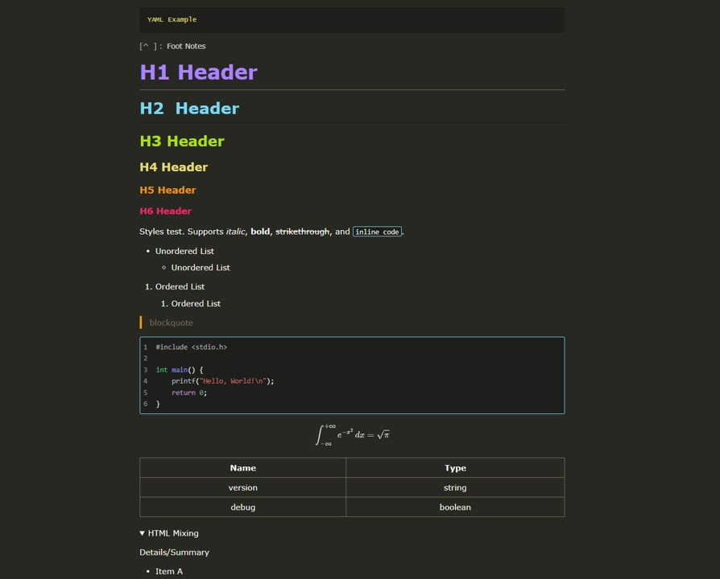

# Before Sunrise

<p>
	
	
	
</p>

> A Typora dark theme inspired by the **VS Code Monokai** color palette.

This is a customized theme for Typora, which integrates parts of Typora's default `github` theme and the open-source `github-dark` theme, with optimizations for Markdown reading and writing, including heading hierarchy colors, code highlighting, and Mermaid diagram styling.

## Preview



## Features

- Monokai-style dark UI with comfortable contrast for long reading sessions.
- Full heading hierarchy colors (H1-H6) for clear document structure recognition.
- Built-in code block highlighting (`codeblock.dark.css`) for common syntax tokens.
- Built-in Mermaid dark style (`mermaid.dark.css`) for consistent flowchart and sequence diagram visuals.
- Key colors are centralized in CSS variables for quick customization.

## Project Structure

Project structure:

```text
BeforeSunrise/
|- pic/
|  `- preview.jpg
`- theme/
   |- before-sunrise.css
   `- before-sunrise/
      |- codeblock.dark.css
      `- mermaid.dark.css
```

## Installation

1. Download or clone this repository.
2. In Typora, open `Preferences` -> `Appearance` -> `Open Theme Folder`.
3. Copy `theme/before-sunrise.css` and the entire `theme/before-sunrise/` folder into Typora's themes directory.
4. Restart Typora, then choose `before-sunrise` from the `Themes` menu.

Typical theme directory on Windows:

```text
%APPDATA%\Typora\themes
```

## Customization

You can quickly adjust colors by editing `:root` variables in `theme/before-sunrise.css`.

Common variables:

- `--body-bg-color`: Editor background color
- `--body-primary-color`: Main text color
- `--heading-color`: 标Heading color
- `--code-bg-color`: Code block background color
- `--code-border-color`: Code block border color

More about Typora theme development:

- [Write Custom Theme for Typora](http://theme.typora.io/doc/Write-Custom-Theme/)

## Compatibility

- Typora (newer versions are recommended)
- Includes dark styles for code highlighting and Mermaid diagrams
- Works on Windows/macOS/Linux (platforms supported by Typora)

## Credits

- Typora default `github` theme
- Open-source `github-dark` theme
- VS Code Monokai palette

## License

This project is licensed under the **GNU General Public License v3.0**.
